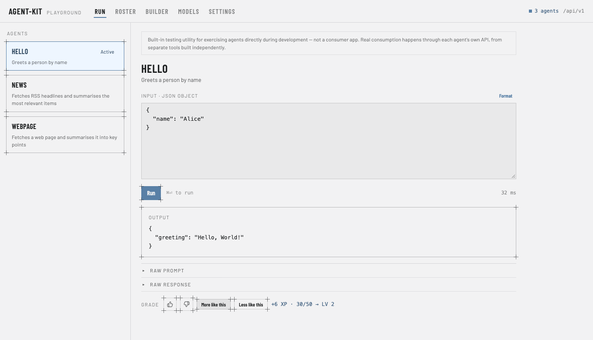
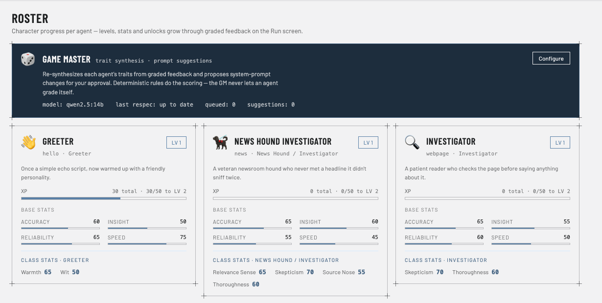
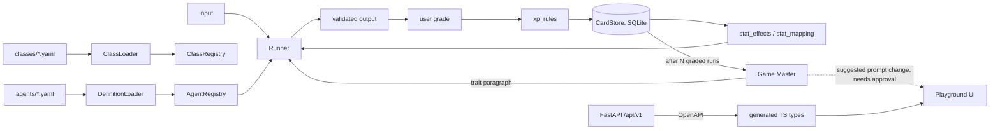

# agent-kit

A small Python library and developer playground for defining AI agents in YAML, running them against local models, and using graded feedback to shape how they behave.

[](https://github.com/waq-b/agent-kit-pro/actions/workflows/ci.yml)



*The Run screen, running in stub mode (no model needed). Real screenshots of the app, not mockups.*

## Why I built it

I wanted a minimal, local-first way to define agents declaratively, get validated structured output from them, and explore one question: can user feedback change an agent's behaviour in a way that stays inspectable and testable, instead of being buried in a prompt that a model rewrites on its own?

## How the feedback loop works

In plain terms: **graded runs feed an evaluation loop that synthesises agent traits and proposes prompt revisions.**

1. You run an agent and grade the result (thumbs up/down, more/less like this).
2. Plain, deterministic code turns each grade into XP and small stat changes, and records it in SQLite.
3. Each stat has authored effects: a text fragment added to the agent's behaviour and a bounded adjustment to runtime parameters (temperature, retries, tool timeout, concurrency). Which fragments and values apply is decided in code.
4. A separate model, the Game Master (GM), rewords the selected fragments into one coherent trait paragraph that is appended to the system prompt. After enough graded runs it can also propose a change to the system prompt. A human has to approve it; the GM never applies changes itself.

The model only handles wording. Scoring, selection and parameter changes are pure functions, so they are unit-testable and the GM can fail without breaking a run (the last good paragraph is reused and the agent is queued for a retry).

### The game framing

I dressed this up as an RPG because it made the mechanics easy to reason about and fun to poke at. Each agent has a character card with a level, XP, base stats, a class (for example Greeter, Investigator, News Hound), and an unlock table. Classes are YAML files and an agent can have a main class and a sub class whose effects stack. The GM is the "Game Master" who narrates the character. Under the costume it is the loop above.



*The Roster screen (real app, stub mode): character cards for the three built-in agents and the Game Master panel.*

## Features

- **Agents as YAML.** Name, system prompt, model, temperature, tools, and Pydantic input and output models, loaded and validated at startup with a specific error type per failure.
- **Pydantic AI runner.** Works against any OpenAI-compatible endpoint (local Ollama by default). Output is validated against the agent's output model and input against its input model.
- **Stub mode.** `STUB_AI_PROVIDERS=1` returns registered fixtures and makes no model calls, so the app and the test suite run offline with no keys.
- **Character layer and Game Master**, as described above.
- **Playground.** A FastAPI service plus a React + TypeScript UI with Run, Roster, Builder (agent wizard and class builder), Models and Settings screens. You can create, edit and delete agents from the UI.
- **Model provider registry.** Register local and "frontier" (hosted) models. Choosing a frontier model in the UI asks for confirmation first, because running it sends data off the machine (see Design decisions).
- **Demo agents.** `hello` (no tools), `news` (fetches RSS feeds) and `webpage` (fetches a page and summarises it).

## Architecture



- `agent_kit/` is the library: loaders, registries, runner, card store, rules, GM.
- `agent_kit/playground/app.py` is the FastAPI service.
- `frontend/` is the React app.

## Stack

Python 3.12, Pydantic and Pydantic AI (pinned), FastAPI, SQLite, PyYAML, pytest and Hypothesis. React 19, TypeScript, Vite, Vitest and Testing Library. GitHub Actions.

## Run it locally

Requires Python 3.12+ and Node 20+. No API keys or model needed in stub mode.

```bash
python3 -m venv .venv
.venv/bin/pip install -e ".[dev]"
(cd frontend && npm install)

STUB_AI_PROVIDERS=1 ./dev.sh
```

Open <http://localhost:5173>. This starts the API on `127.0.0.1:8000` and the Vite dev server together. Drop `STUB_AI_PROVIDERS` to use a local model through Ollama (default `qwen2.5:14b`; the endpoint is configurable in Settings). On Windows use `.\dev.ps1`; `./backend.sh` starts the API alone. All environment variables are listed in [`.env.example`](.env.example), and the playground is described in more detail in [docs/playground.md](docs/playground.md).

## Tests and CI

I ran both suites for this README:

- Backend: **385 pytest tests**, all offline in stub mode, including 11 Hypothesis property-based tests (in `tests/test_properties.py`).
- Frontend: **15 Vitest tests** (Testing Library, jsdom), plus `tsc` typecheck and a production build.

```bash
STUB_AI_PROVIDERS=1 .venv/bin/python -m pytest
cd frontend && npm run typecheck && npm test && npm run build
```

GitHub Actions runs both halves on every push and PR to `main`, plus a generated-types drift check.

## Design decisions

1. **The model never scores or tunes itself.** XP, stat nudges, fragment selection and runtime parameters are pure functions with no I/O. The LLM only smooths prose, and prompt changes need human approval.
2. **Stat effects are bounded deltas.** That is what lets several stats and two classes combine predictably, like modifiers in a tabletop game, and keeps every parameter in a safe range.
3. **Types are generated, not hand-written.** `scripts/dump_openapi.py` writes `frontend/openapi.json` offline and `openapi-typescript` produces `schema.d.ts`. CI regenerates both and fails if the committed copies differ, so the frontend and the Pydantic models cannot drift silently.
4. **Data leaving the machine needs a confirmation, and keys stay server-side.** Selecting a frontier model in any model dropdown shows where data will be sent and only applies on Confirm. Model API keys are never returned to the browser (only `has_api_key: true/false`). Be aware that the confirmation is a UI safeguard only: the API itself does not require it, and keys are stored in plain text in `agent_kit_data/settings.json` (git-ignored).
5. **Stub mode as a first-class citizen.** Every code path that would call a model has a fixture path, which is what makes the whole suite deterministic and the demo keyless.

## Status

Personal project, version 0.5.0 (see [CHANGELOG.md](CHANGELOG.md)). The playground binds to localhost and has no authentication; it is a development tool, not a multi-tenant service. The FastAPI service does not serve the built frontend, so run the Vite dev server. Some unlock-table entries are data-only placeholders with no effect yet (for example the "Paid Model Access" and "Assistant Delegate" unlocks on `news`, and `webpage`'s "Pull Quote"), and live-model behaviour (the real runner and GM) was developed against a local `qwen2.5:14b` and is not covered by CI, which runs in stub mode.

## License

MIT, see [LICENSE](LICENSE).
